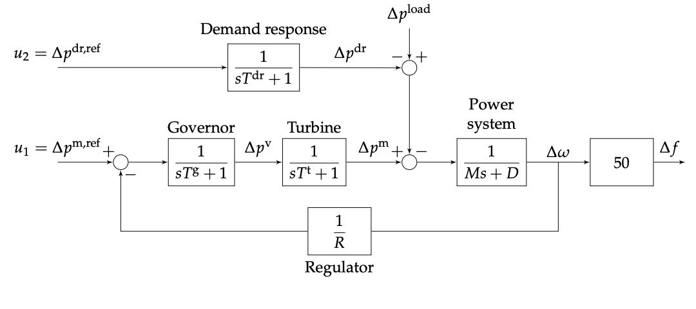

# Grid MPC

The challenge is to design an MPC-based controller for maintaining the stability of an electricity grid that uses renewables for generation. 

The system block diagram is given as the following:



The given state-space prediction model is:

```math

\frac{d}{dt}
\begin{pmatrix}
\Delta \omega(t)\\
\Delta p^m(t)\\
\Delta p^v(t)\\
\Delta p^{dr}(t)
\end{pmatrix}
= 
\begin{pmatrix}
-D/M & 1/M & 0 & 1/M\\
0 & -1/T^t & 1/T^t & 0 \\
-1/(R\cdot T^g) & 0 & -1/T^g &0 \\
0 & 0 & 0 & -1/T^{dr}
\end{pmatrix}
\begin{pmatrix}
\Delta \omega(t)\\
\Delta p^m(t)\\
\Delta p^v(t)\\
\Delta p^{dr}(t)
\end{pmatrix}
\\
+

\begin{pmatrix}
0 & 0\\
0 & 0\\
1/T^g & 0\\
0 & 1/T^{dr}\\
\end{pmatrix}

\begin{pmatrix}
\Delta p^{m, ref}(t) \\
\Delta p^{dr, ref}(t) \\
\end{pmatrix}

+
\begin{pmatrix}
-1/M\\
0\\
0\\
0\\
\end{pmatrix}
\Delta p^{load}(t)

```


### Explaining the Variables

1. $\Delta \omega (t)$
    1. Represents the deviation of **grid frequency** from the synchronous frequency of $50Hz$, using a normalised unit.
2. $\Delta p^m (t)$ 
    1. Represents the deviation from the **nominal mechanical** power output of the steam turbine, using a normalised unit.
3. 2. $\Delta p^v (t)$ 
    1. Represents the deviation from the **governed mechanical** power output of the governor, using a normalised unit.
4. $\Delta p^{dr} (t)$
    1. Represents the **demand response**, using a normalised unit. This is the value used to reduce the difference in load, ie, $\Delta p^{load} (t)$, and the physical means for doing this is through the transfer of money (paying users).
5. $\Delta p^{load} (t)$
    1. Represents the deviation from **nominal net power demand**, using a normalised unit. This is the difference between the power _demanded by consumers_ and the _power generated by renewables_. 

## Unconstrained

First attempt at the unconstrained controller


Here we can see the unconstrained controller successfully controlling the system. 
The controller itself can be validated as _stabilising_ through checking the spectral radius, which returns $SR = 0.8095604134222927\le 1$ hence the controller is stabilising. 

## Constrained


## Disturbance Rejection


## Reference Tracking


